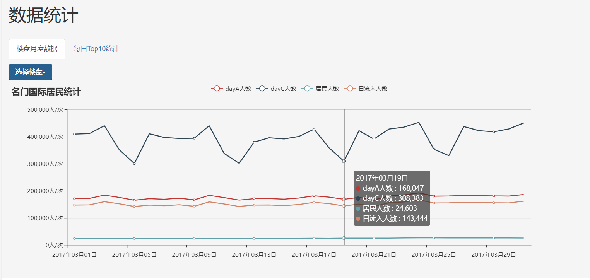
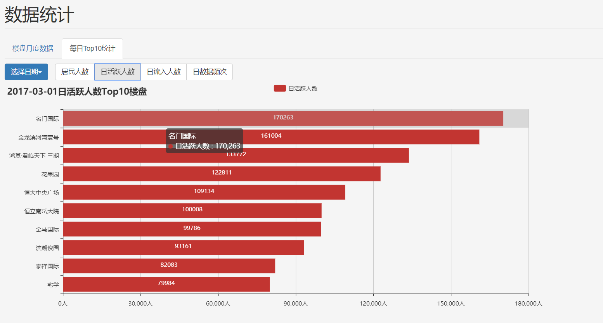
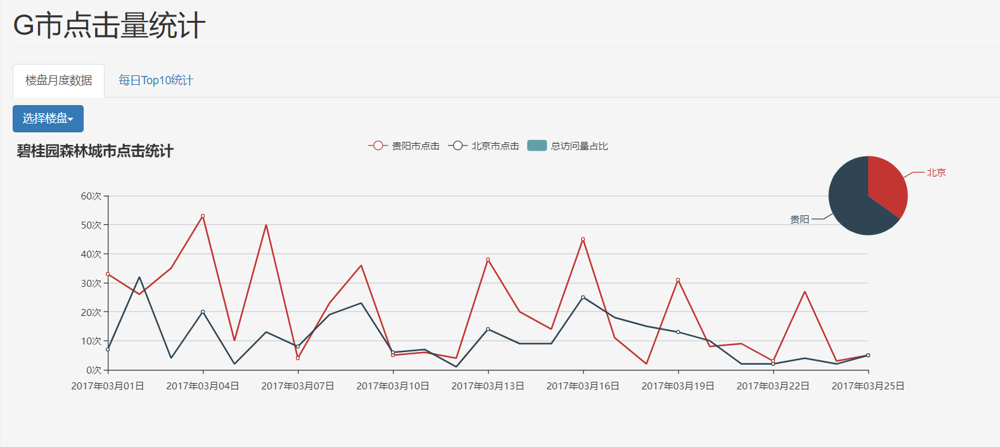
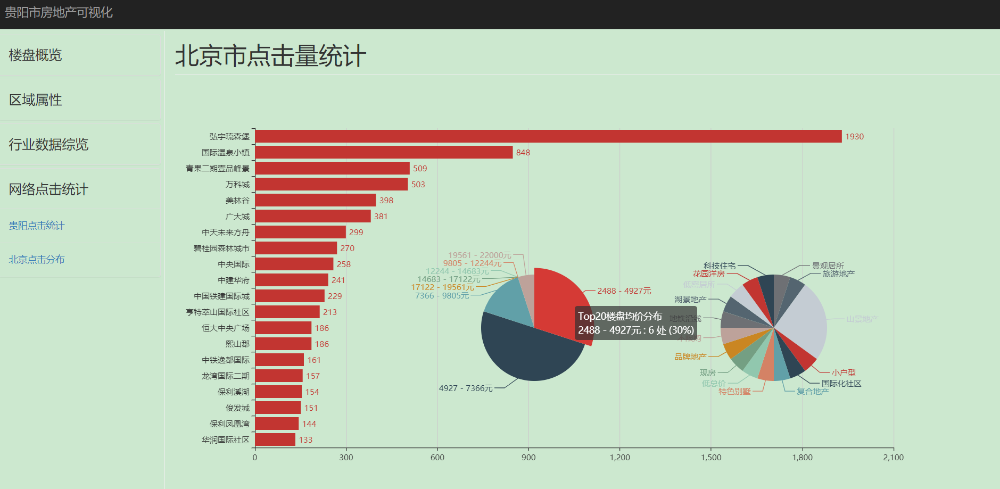

# G市房地产分布可视化

### 简介
 通过前端技术，使用互联网与某行业数据对G市房地产及相关人群进行多维度分析展示

### 涉及技术

语言：HTML，CSS，JavaScript

库与框架：JQuery, Bootstrap, Echarts

其它： 百度地图API

### 运行环境

数据使用了ajax进行异步加载，因此需要一个服务器环境，例如Tomcat，Apache或Node.js等，通过localhost查看效果。 

### 视觉效果
楼盘分布页面demo预览

楼盘列表页面demo预览

POI分布页面demo预览

数据统计页面预览图

贵阳市点击统计页面预览图

北京市点击量统计页面预览图
